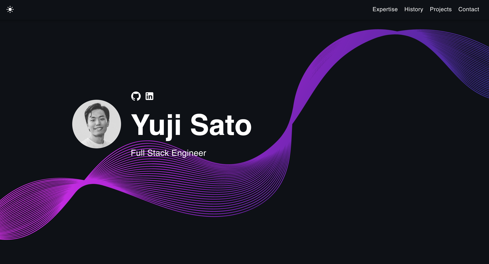

<!-- # Developer Portfolio Template 🚀

      

## What is this?

This simple portfolio template is designed to showcase your past projects, career history, skill sets, and more.

View the [Demo](https://yujisatojr.github.io/react-portfolio-template/).

**This template is free to use, and no attribution is required.** You can fork or download this repository to customize it for your own use. Please don't forget to leave a ⭐ if you like this portfolio!



## Features

✅ Open source (free to use, no attribution required)  
✅ Responsive design & mobile-friendly  
✅ Supports both dark and light modes  
✅ Highly customizable multi-component layout  
✅ Built with modern technologies (React, TypeScript, JavaScript, and SCSS)  

## Quick Setup

1. Ensure you have [Node.js](https://nodejs.org/) installed. Check your installation by running:

    ```bash
    node -v
    ```

2. In the project directory, install dependencies:

    ```bash
    npm install
    ```

3. Start the development server:

    ```bash
    npm start
    ```

4. Open [http://localhost:3000](http://localhost:3000) to view the app in the browser.

5. Customize the template by navigating to the `/src/components` directory. Modify texts, pictures, and other information as needed.

The page will reload if you make edits, and you will see any lint errors in the console.

If you are interested in creating a mockup image like the ones from the personal projects section, I recommend [Genmoo](https://gemoo.com/tools/browser-mockup-generator/). This website lets you generate sleek looking browser mockups for free.

## Deployment

You can choose your preferred service (e.g., [Netlify](https://www.netlify.com/), [Render](https://render.com/), [Heroku](https://www.heroku.com/)) for deployment. One of the easiest ways to host this portfolio is using GitHub Pages. Follow the instructions below for a production deploy.

1. **Set Up GitHub Repository**

    Create a new repository on GitHub for your portfolio app.

2. **Configure `package.json`**

    Edit the following properties in your `package.json` file:

    ```json
    {
        "homepage": "https://yourusername.github.io/your-repo-name",
        "scripts": {
            "predeploy": "npm run build",
            "deploy": "gh-pages -d build",
            ...
        }
    }
    ```

    Replace `yourusername` with your GitHub username and `your-repo-name` with the name of your GitHub repository.

3. **Deploy to GitHub Pages**

    Run the following command to deploy your app:

    ```bash
    npm run deploy
    ```

4. **Access Your Deployed App**

    After successfully deploying, you can access your app at `https://yourusername.github.io/your-repo-name`. -->

# Portfolio de Développeur - Adam Boucquemont 🚀

## Qu'est-ce que c'est ?

Ce portfolio est ma vitrine personnelle en ligne, conçue pour présenter mes projets passés, mon parcours professionnel, mes compétences techniques et bien plus encore.

**Ce portfolio est basé sur un template open-source.** J'ai personnalisé ce template pour refléter mon profil et mes réalisations. L'original, créé par un contributeur open-source, est disponible gratuitement sans attribution obligatoire. Vous pouvez le retrouver ici : [Developer Portfolio Template](https://github.com/yujisatojr/react-portfolio-template)


## Installation rapide

Pour tester ou modifier ce portfolio, suivez les étapes ci-dessous :

1. Assurez-vous que [Node.js](https://nodejs.org/) est installé sur votre machine. Vérifiez votre installation en exécutant :

    ```bash
    node -v
    ```

2. Dans le répertoire du projet, installez les dépendances :

    ```bash
    npm install
    ```

3. Lancez le serveur de développement :

    ```bash
    npm start
    ```

4. Ouvrez [http://localhost:3000](http://localhost:3000) pour afficher l'application dans votre navigateur.

5. Personnalisez le template en naviguant vers le répertoire `/src/components`. Modifiez les textes, images et autres informations selon vos besoins.

## Déploiement

Vous pouvez choisir votre service préféré (par exemple, [Netlify](https://www.netlify.com/), [Render](https://render.com/), [Heroku](https://www.heroku.com/)) pour déployer ce portfolio. Une des solutions les plus simples est d'utiliser GitHub Pages. Suivez les instructions ci-dessous pour effectuer un déploiement en production.

1. **Créez un dépôt GitHub**

    Créez un nouveau dépôt sur GitHub pour votre application de portfolio.

2. **Configurez `package.json`**

    Modifiez les propriétés suivantes dans le fichier `package.json` :

    ```json
    {
        "homepage": "https://votreutilisateur.github.io/votre-repo",
        "scripts": {
            "predeploy": "npm run build",
            "deploy": "gh-pages -d build",
            ...
        }
    }
    ```

    Remplacez `votreutilisateur` par votre nom d'utilisateur GitHub et `votre-repo` par le nom de votre dépôt GitHub.

3. **Déployez sur GitHub Pages**

    Exécutez la commande suivante pour déployer votre application :

    ```bash
    npm run deploy
    ```

4. **Accédez à votre application déployée**

    Une fois le déploiement réussi, vous pouvez accéder à votre application à l'adresse `https://votreutilisateur.github.io/votre-repo`.
